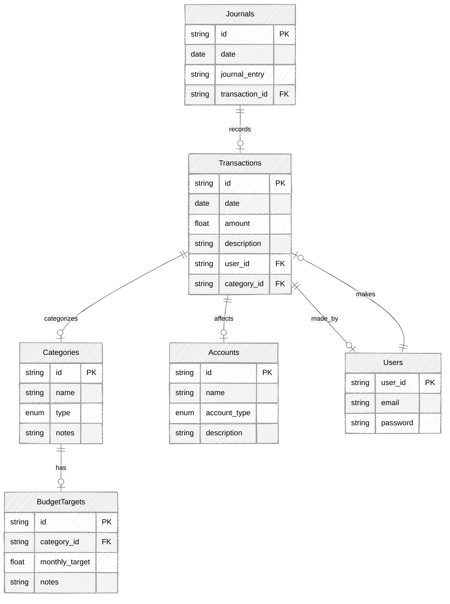
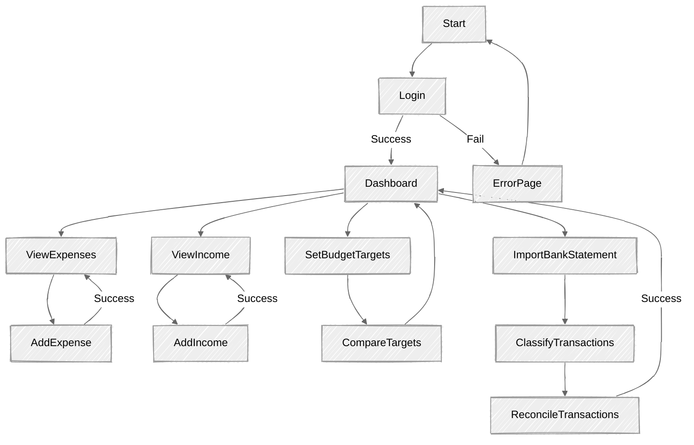
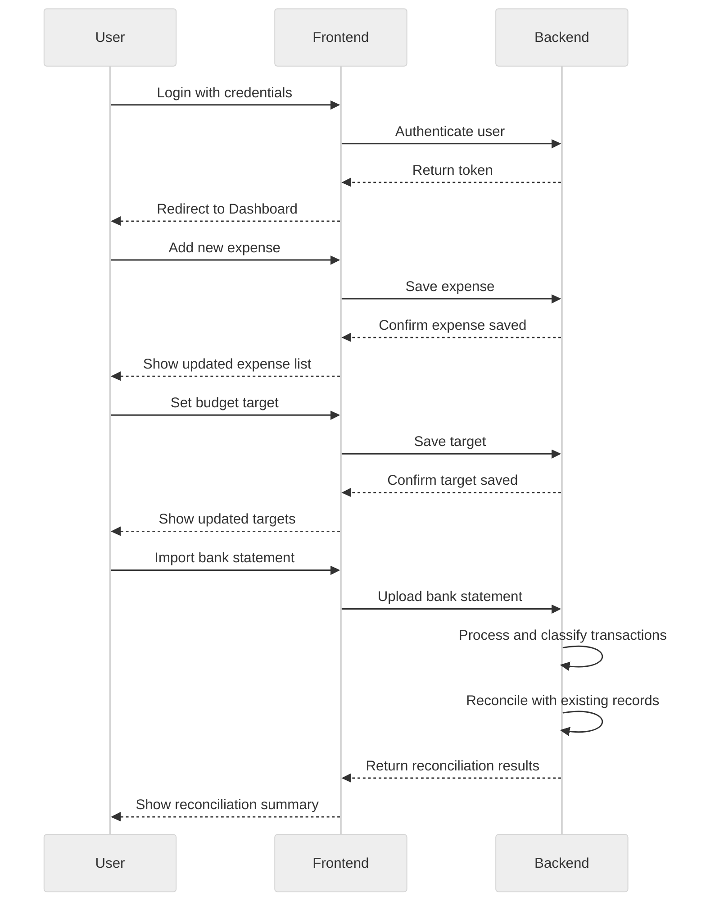

# Fin Sync : Sync your finances
The Budget Tracking Tool is a web application that allows users to manage their personal finances by tracking income, expenses, and budget targets.The application will be built using Vue.js for the frontend, Tailwind CSS for styling, and Appwrite as the backend service for authentication, database, and storage.

## System Architecture

### Frontend
-   **Framework:** Vue.js 3
-   **Styling:** Tailwind CSS
-   **State Management:** Pinia
-   **Routing:** Vue Router
-   **API Communication:** Axios for calling Appwrite SDK

### Backend
-   **Backend-as-a-Service:** Appwrite
-   **Services Used:**
    -   **Authentication**: User registration, login, and session management
    -   **Database**: Collections for categories, expenses, income, and budget targets
    -   **Storage**: File uploads (e.g., receipts)
    -   **Functions**: Server-side logics or utilities or jobs

1.  **User Authentication**
    -   User registration
    -   Login and logout
    -   Password reset

2.  **Expense Management**
    -   Add, edit, delete expenses
    -   Categorize expenses (e.g., food, rent, transportation)
    -   View expense history
    -   Filter expenses by date, category, or amount

3.  **Income Management**
    -   Add, edit, delete income entries
    -   Categorize income sources (e.g., salary, bonus, freelance work)
    -   View income history
    -   Filter income by date, category, or amount

4.  **Budget Target Management**
    -   Set monthly budget targets for different categories
    -   Compare actual spending against targets
    -   Calculate implied annual spending based on current data

5.  **Dashboard**
    -   Display total income, expenses, and remaining balance
    -   Show comparisons to budget targets
    -   Provide drill-down insights into spending by category

6.  **Category Setup**
    -   Allow users to customize expense and income categories
    -   Support up to 80 categories

7.  **Historical Comparison**
    -   Track spending trends over time
    -   Compare current spending with previous months or years

8.  **Reports and Charts**
    -   Generate charts showing income vs. expenses
    -   Visualize category-wise spending
    -   Export reports to PDF or Excel

9.  **Bank Statement Import and Classification**
    -   Import bank statements in supported formats (e.g., CSV, Excel, PDF)
    -   Automatically identify income and expenses from the imported data
    -   Classify transactions into predefined categories
    -   Allow users to review and adjust classifications
    -   Provide summary reports of imported transactions

10.  **Reconciliation**
    -   Reconcile imported bank statements with manually entered transactions
    -   Identify discrepancies between bank statements and recorded transactions
    -   Provide a reconciliation summary showing matched and unmatched transactions
    -   Allow users to mark transactions as reconciled
    -   Automatically update the dashboard and reports based on reconciliation status

### Database Schema (Appwrite)

#### **Collections:**

## Activity Diagram
Here is the activity diagram showing the flow of user interactions with the fin-sync

## Sequence Diagram

The following sequence diagram shows the interactions between the user, frontend, and backend

